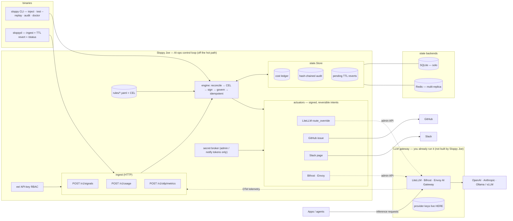
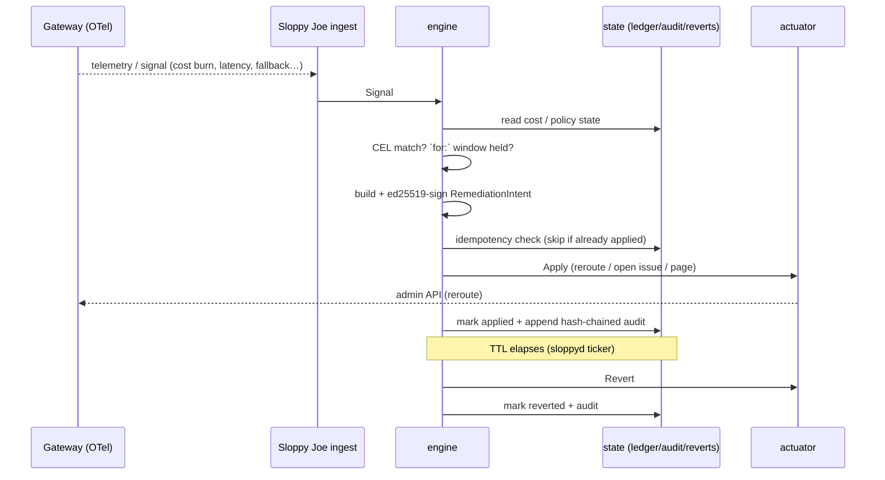

# 🥪 Sloppy Joe

**Serving governed AI ops.** Sloppy Joe is an open-source, model-agnostic **control loop** that cleans up the slop of running AI in production. It sits *on top of* the LLM gateway you already run and turns model-layer signals — cost spikes, fallback storms, latency/quality regressions, guardrail trips, provider outages — into **governed, audited, Git-reviewed automated responses**.

> It is **not** another LLM gateway. It's the observe → decide → act loop that gateways and generic automation tools leave as a gap you currently fill with duct tape (n8n + a budget cron + Grafana alerts).

## The one-liner

A cost / eval / guardrail breach spawns a governed, capability-scoped, audited remediation whose **policy is a file in Git you review in a PR and replay in CI** — executed as a signed, reversible intent any gateway can apply.

## What it feels like

```text
# one-shot: run a signal through your rules (acts, then writes the audit)
$ sloppy inject --rules examples/rules examples/signals/cost-spike.json
  applied            route_override target=gpt-4o
  applied            page target=gpt-4o

# CI gate: replay a fixture and see what WOULD fire (no side effects)
$ sloppy test --replay examples/fixtures/replay.jsonl --rules examples/rules
  replay: 4 signal(s), 6 intent(s) would fire

# the tamper-evident audit log
$ sloppy audit tail
  chain: verified ✓ (3 entries)

# run continuously: HTTP ingest + TTL auto-revert + /status metrics
$ sloppyd --rules examples/rules
  🥪 sloppyd listening on :8723
```

> The command is **`sloppy`** (`sloppy up`, `sloppy audit tail`). We avoided `joe` because it collides with the classic `joe` editor (Joe's Own Editor) on many Unix systems — the brand stays **Sloppy Joe**.

## Status

✅ **v0 implemented (Plans 1–4).** Library (`libsloppyjoe`) + `sloppy` CLI + `sloppyd` daemon. `go test ./...` green across all packages; static `CGO_ENABLED=0` binaries. Design + plans live under [`docs/superpowers/`](docs/superpowers/). A **Phase-0 demand-validation** with design partners runs in parallel (see [`docs/vision.md`](docs/vision.md)).

## Architecture

Sloppy Joe is a **control loop, not a gateway** — it sits beside the LLM gateway you already run, consumes its telemetry, and acts back on it through narrow, signed, reversible intents. It is never on the inference request hot path, and it never holds your provider keys.



> Everything in this diagram is implemented and tested.

The runtime loop — **observe → decide → act → record → revert** — all off the request hot path:



## Quickstart

```bash
go build -o bin/sloppy  ./cmd/sloppy
go build -o bin/sloppyd ./cmd/sloppyd

# fire a recorded signal through the example rules, then read the audit
./bin/sloppy inject --rules examples/rules --db /tmp/sloppy.db examples/signals/cost-spike.json
./bin/sloppy audit tail --db /tmp/sloppy.db

# or run the daemon and POST signals / usage over HTTP
./bin/sloppyd --rules examples/rules --db /tmp/sloppy.db &
curl -XPOST localhost:8723/v1/signals -d @examples/signals/cost-spike.json
curl localhost:8723/status
```

**Commands:** `sloppy inject` · `sloppy test --replay` · `sloppy audit tail` · `sloppy doctor` · `sloppyd` (daemon).
- **State backend:** `sloppyd --store sqlite` (default) or `--store redis --redis-addr host:6379`.
- **Auth:** `sloppyd --auth` with `SLOPPY_API_KEYS="key1=ingest:write,status:read"`.
- **Gateway:** to wire a real LiteLLM admin API, set `SLOPPY_LITELLM_URL` and `SLOPPY_TOKEN_LITELLM`.

## Principles

- **Model-agnostic** — consumes OpenTelemetry GenAI + CloudEvents, acts via vendor-neutral signed intents
- **Linux/Unix-first** — single static Go binary
- **Library-first** — a small core library; CLI + daemon are thin wrappers
- **Packageable solo → enterprise** from one core (swappable adapters)
- **Issue-driven · automation-first** — and multi-purpose, not single-purpose
- **Never holds your provider keys** — those stay in the gateway

## License

Intended: **Apache-2.0** (permissive, with a patent grant). `LICENSE` to be added at design lock.

---

*Built in the open. Contributions welcome once the v0 design is locked.*
